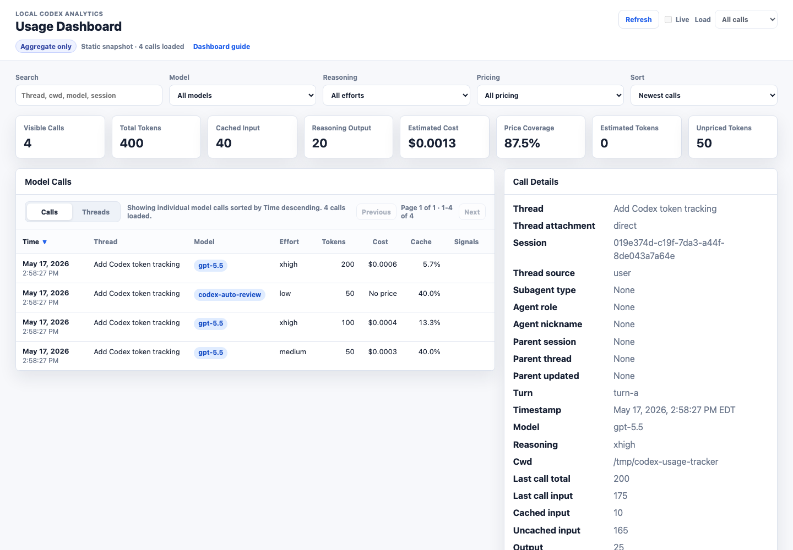
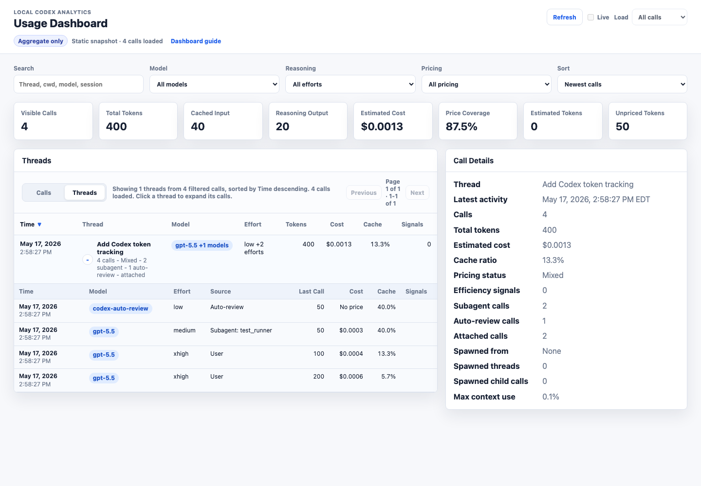
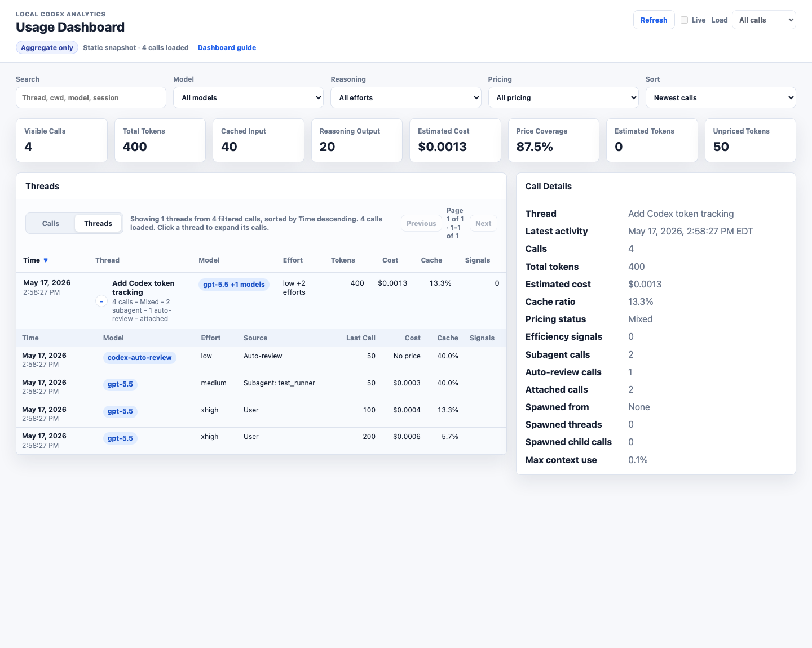

# Dashboard Guide

This guide uses synthetic aggregate data. The screenshots do not contain prompts, assistant text, tool output, or real Codex session content.

## Open The Dashboard

For the best experience, run the localhost dashboard server:

```bash
codex-usage-tracker update-pricing
codex-usage-tracker serve-dashboard --open
```

The server keeps the HTML aggregate-only and enables two live features:

- `Refresh` rescans local Codex logs and updates the dashboard rows.
- `Load context` reads one selected model call from the original local JSONL file only when you ask for it.

For a static snapshot, use:

```bash
codex-usage-tracker dashboard --open
```

Static file mode can still filter, sort, and inspect aggregate call fields. It cannot refresh from logs or load raw context until you open the dashboard through `serve-dashboard`.

## Calls View



The dashboard opens in `Calls` view. This is the most direct way to inspect individual model calls.

- The header stays compact: refresh controls on the right, aggregate/privacy status on the left.
- Search matches thread, cwd, model, session id, turn id, subagent role, and parent thread fields.
- The cards summarize only the currently visible filtered rows.
- Time values are shown in your browser's local date/time format while sorting still uses the logged timestamp.
- Click a column header like `Time`, `Thread`, `Tokens`, `Cost`, or `Cache` to sort. Click the same header again to reverse the direction.
- Hover or click a row to pin its aggregate fields in `Call Details`; on desktop, the details panel stays visible as you scroll.
- After you scroll down, the bottom-right `Top` button returns to the top of the dashboard.

Useful interpretation notes:

- `Last call total` is the token usage for the selected model call.
- `Session cumulative` is the running total Codex logged for that session at the time of that call.
- `Cached input` and `Uncached input` are split so cache behavior is visible without storing transcript text.
- A cost with `*` means the pricing row is marked as a best-guess estimate.

## Threads View



Use `Threads` view when you want to understand a work session as a group instead of one call at a time.

- Each thread row groups the filtered model calls by thread name, falling back to session id when no name is available.
- Thread rows show latest activity, call count, model mix, effort mix, total tokens, estimated cost, cache ratio, and signal count.
- Mixed model summaries prefer the primary non-review model; `codex-auto-review` appears as the thread model only for review-only threads.
- Click a thread row to expand or collapse its calls. Multiple thread rows can stay open.
- Expanded calls are ordered oldest to newest by event timestamp, then cumulative token count.
- Subagents with logged parent session ids are shown under the parent thread. Auto-review sessions without explicit parent ids may be attached by cwd and nearby activity and are marked as attached or inferred in the details.

The same filters, pricing status, load limit, cards, and sort controls apply in both `Calls` and `Threads` views.

## Details And Context



The details panel is intentionally field-heavy so the table can stay compact. On desktop, it sticks inside the viewport and scrolls internally when the selected call has more fields or loaded context than can fit on screen.

For selected calls, the panel shows:

- thread attachment and parent-thread fields
- session id, turn id, timestamp, cwd, model, and reasoning effort
- input, cached input, uncached input, output, reasoning output, and total tokens
- estimated cost, cache savings, pricing model, and pricing status
- context window size and context-window percentage
- source JSONL file and line number

When served from localhost, the details panel includes `Load context` and `Include tool output`.

- `Load context` fetches a size-limited, redacted context excerpt for only that call.
- `Include tool output` repeats the request with tool output included, still redacted and capped.
- Raw context is not written to SQLite, CSV, or the generated dashboard HTML.

## Practical Workflow

1. Start with `serve-dashboard --open`.
2. Use `Refresh` after a Codex run finishes, or leave `Live` enabled while you work.
3. Use `Threads` view to find the active work thread and any spawned subagent calls.
4. Sort by `Cost` or `Tokens` to find expensive work.
5. Sort by `Cache` to find calls with poor prompt-cache reuse.
6. Filter to one model or reasoning effort when comparing efficiency.
7. Click into a row and use `Load context` only when aggregate fields are not enough to explain the call.

## Privacy Model

The dashboard is designed to be shareable as an aggregate report, but only after you review it like any generated artifact.

It includes:

- session ids, thread names, cwd values, source file paths, timestamps, model labels, reasoning effort, token counts, costs, and derived ratios

It does not include:

- prompts, assistant responses, raw tool output, pasted secrets, message snippets, or transcript text

The screenshots in this guide are produced from synthetic fixture data used by the test suite.
